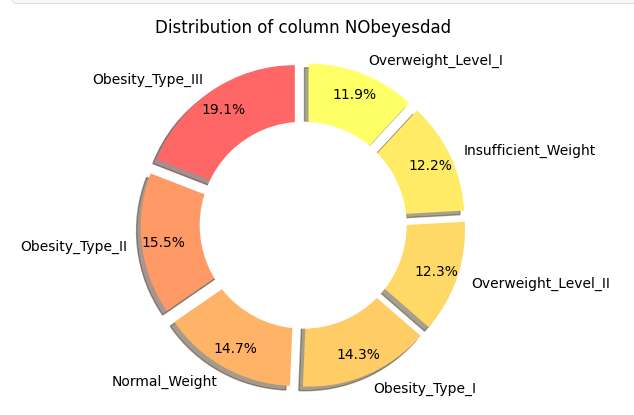
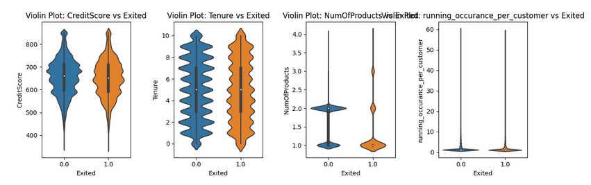
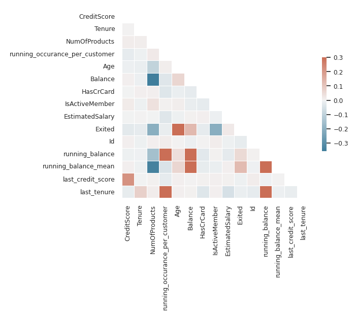
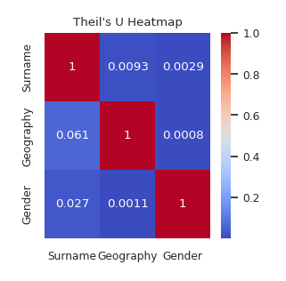
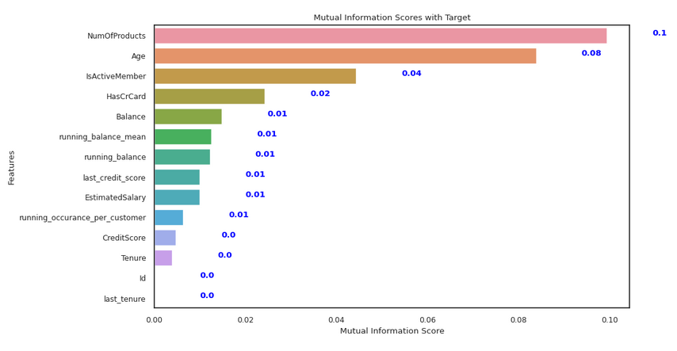

# Explanatory analysis

BlueCast offers a simple way to get a first overview of the data:

```sh
from bluecast.eda.analyse import (
    bi_variate_plots,
    univariate_plots,
    plot_count_pairs,
    correlation_heatmap,
    correlation_to_target,
    plot_ecdf,
    plot_pca,
    plot_pca_cumulative_variance,
    plot_theil_u_heatmap,
    plot_tsne,
    check_unique_values,
    plot_null_percentage,
    mutual_info_to_target.
    plot_pie_chart,
)

from bluecast.preprocessing.feature_types import FeatureTypeDetector

# Here we automatically detect the numeric columns
feat_type_detector = FeatureTypeDetector()
train_data = feat_type_detector.fit_transform_feature_types(train_data)

# detect columns with a very high share of unique values
many_unique_cols = check_unique_values(train_data, feat_type_detector.cat_columns)
```

```sh
# plot the percentage of Nulls for all features
plot_pie_chart(
        synthetic_train_test_data[0],
        "categorical_feature_1",
    )
```



```sh
# plot the percentage of Nulls for all features
plot_null_percentage(
    train_data.loc[:, feat_type_detector.num_columns],
    )
```


```sh
# show univariate plots
univariate_plots(
        train_data.loc[:, feat_type_detector.num_columns],  # here the target column EC1 is already included
    )
```


```sh
# show bi-variate plots
bi_variate_plots(
    train_data.loc[:, feat_type_detector.num_columns],
      "EC1"
      )
```

```sh
# show univariate plots
plot_ecdf(
        train_data, feat_type_detector.num_columns,  plot_all_at_once=True
    )
```



```sh
# show bi-variate plots
plot_count_pairs(
    train,
    test,
    cat_cols=train_data.loc[:, feat_type_detector.cat_columns],
      )
```


```sh
# show correlation to target
correlation_to_target(train_data.loc[:, feat_type_detector.num_columns])
```


```sh
# show correlation heatmap
correlation_heatmap(train_data.loc[:, feat_type_detector.num_columns])
```



```sh
# show a heatmap of assocations between categorical variables
theil_matrix = plot_theil_u_heatmap(train_data, feat_type_detector.cat_columns)
```



```sh
# show mutual information of categorical features to target
# features are expected to be numerical format
# class problem can be any of "binary", "multiclass" or "regression"
extra_params = {"random_state": 30}
mutual_info_to_target(train_data.loc[:, feat_type_detector.num_columns], "EC1", class_problem="binary", **extra_params)
```



```sh
## show feature space after principal component analysis
plot_pca(
    train_data.loc[:, feat_type_detector.num_columns],
    "target"
    )
```


```sh
## show how many components are needed to explain certain variance
plot_pca_cumulative_variance(
    train_data.loc[:, feat_type_detector.num_columns],
    "target"
    )
```


```sh
# show feature space after t-SNE
plot_tsne(
    train_data.loc[:, feat_type_detector.num_columns],
    "target",
    perplexity=30,
    random_state=0
    )
```


With big data and complex pipelines data leakage can easily sneak in.
To detect leakage BlueCast offers two functions:

```sh
from bluecast.eda.data_leakage_checks import (
    detect_categorical_leakage,
    detect_leakage_via_correlation,
)


# Detect leakage of numeric columns based on correlation
result = detect_leakage_via_correlation(
        train_data.loc[:, feat_type_detector.num_columns], "target", threshold=0.9
    )

# Detect leakage of categorical columns based on Theil's U
result = detect_categorical_leakage(
        train_data.loc[:, feat_type_detector.cat_columns], "target", threshold=0.9
    )
```
