# Explanatory analysis

BlueCast offers a simple way to get a first overview of the data.
Instead of writing many lines of code, BlueCast provides handy
functions to focus on the data rather than the implementation
of visualizations.

<!-- toc -->

* [Explanatory analysis](#explanatory-analysis)
  * [Feature type detection](#feature-type-detection)
  * [Pie chart](#pie-chart)
  * [Nulls per column](#nulls-per-column)
  * [Univariate plots](#univariate-plots)
  * [Empirical cumulative density function (eCDF)](#empirical-cumulative-density-function-ecdf)
  * [Bivariate plots](#bivariate-plots)
  * [Count pairs](#count-pairs)
  * [Classification target distribution in categorical features](#classification-target-distribution-in-categorical-features)
  * [Correlation to the target](#correlation-to-the-target)
  * [Correlation heatmap](#correlation-heatmap)
  * [Andrew Curve](#andrew-curve)
  * [Association of categorical features](#association-of-categorical-features)
  * [Mutual information](#mutual-information)
  * [Principal components analysis (PCA)](#principal-components-analysis-pca)
  * [PCA cumulative variance](#pca-cumulative-variance)
  * [t-SNE](#t-sne)
  * [Target leakage](#target-leakage)
  * [Feature distribution over time](#feature-distribution-over-time)

<!-- tocstop -->

## Feature type detection

Many datasets come still in the form of CSVs or have object type
due to the import from Excel files. With growing column size it
requires lots of time to study the features and cast them
appropriately. BlueCast offers a `FeatureTypeDetector` to automate
this task.
The same detector is also used as part of the BlueCast ml pipelines,
thus allowing users to check the results of this operation outside
of the pipeline.

```sh
from bluecast.eda.analyse import (
    plot_andrews_curve,
    bi_variate_plots,
    univariate_plots,
    plot_classification_target_distribution_within_categories,
    plot_count_pairs,
    plot_distribution_by_time,
    correlation_heatmap,
    correlation_to_target,
    plot_ecdf,
    plot_pca,
    plot_pca_biplot,
    plot_pca_cumulative_variance,
    plot_theil_u_heatmap,
    plot_tsne,
    check_unique_values,
    plot_null_percentage,
    mutual_info_to_target,
    plot_pie_chart,
)

from bluecast.preprocessing.feature_types import FeatureTypeDetector

# Here we automatically detect the numeric columns
feat_type_detector = FeatureTypeDetector()
train_data = feat_type_detector.fit_transform_feature_types(train_data)

# detect columns with a very high share of unique values
many_unique_cols = check_unique_values(train_data, train_data.columns.to_list())
```

## Pie chart

To show the distribution of target classes or categories pie charts
can be a viable option. Our implementation has been designed to be
visually appealing and insightful alike:

```sh
# plot the percentage of Nulls for all features
plot_pie_chart(
        synthetic_train_test_data[0],
        "categorical_feature_1",
    )
```

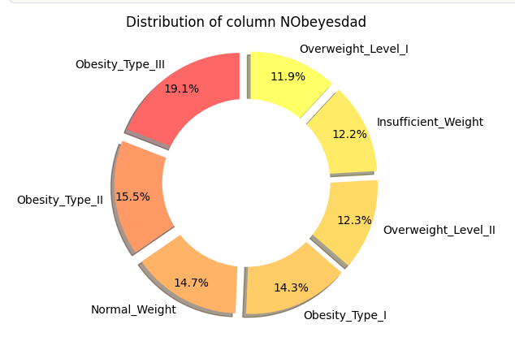

## Nulls per column

Even though tree-based models like Xgboost can handle missing values
out-of-the-box it is still relevant to observe the distribution of
missing values. Here we offer a bar chart showing the percentage of
missing values per column.

```sh
# plot the percentage of Nulls for all features
plot_null_percentage(
    train_data.loc[:, feat_type_detector.num_columns],
    )
```

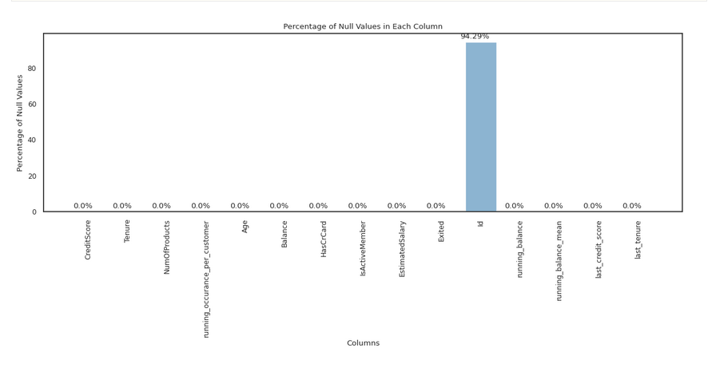

## Univariate plots

The univariate plots function loops through the data and shows
histogram and boxplot for each numerical column.

```sh
# show univariate plots
univariate_plots(
        train_data.loc[:, feat_type_detector.num_columns],  # here the target column EC1 is already included
    )
```

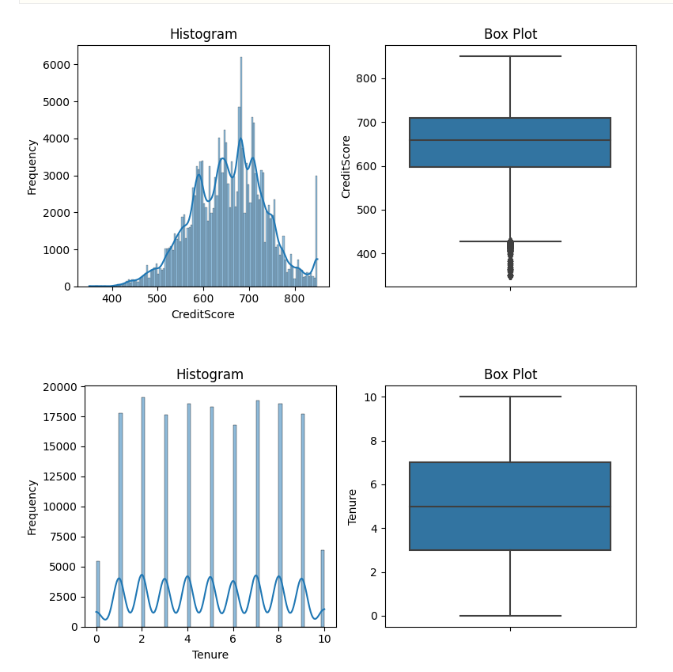

## Empirical cumulative density function (eCDF)

In some cases histograms might be misleading or boxplots cannot
show the distribution conveniently due to outliers. In such cases
eCDFs provide an alternative way to understand univariate
distributions. The plots can either be split by column or can
all be combined into one chart.

```sh
# show univariate plots
plot_ecdf(
        train_data, feat_type_detector.num_columns,  plot_all_at_once=True
    )
```

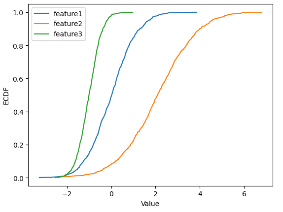

## Bivariate plots

Bivariate plots are useful to understand how features differ
in regard to a discrete target (either classes or bins of
a continous target).

```sh
# show bi-variate plots
bi_variate_plots(
    train_data.loc[:, feat_type_detector.num_columns],
      "EC1"
      )
```

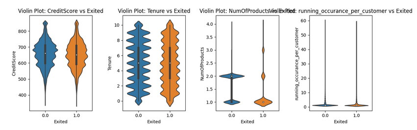

## Count pairs

Count pairs are intended to compare the distribution of categories
between two datasets. This can be useful to check if an evaluation
dataset is representative or if data drift occurs.

```sh
# show bi-variate plots
plot_count_pairs(
    train,
    test,
    cat_cols=train_data.loc[:, feat_type_detector.cat_columns],
      )
```

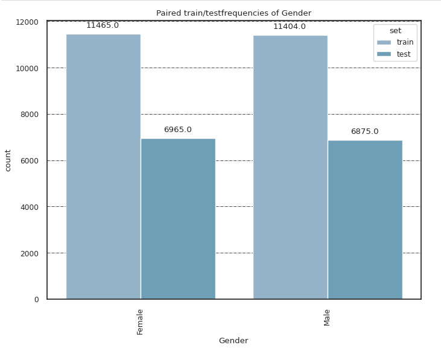

## Classification target distribution in categorical features

We might also want to see how target classes are distributed
within categorical features. This can be plotted with:

```python
from bluecast.eda.analyse import plot_distribution_by_time

plot_classification_target_distribution_within_categories(
    train,
    cat_columns=train_data.loc[:, feat_type_detector.cat_columns],
    target_col="target"
      )
```

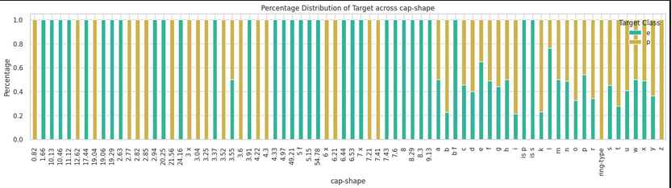

## Correlation to the target

For feature selection it might be useful to understand how much
each feature can explain the target variable. To capture linear
signal the correlation uses Pearson's r to indicate that.

```sh
# show correlation to target
correlation_to_target(train_data.loc[:, feat_type_detector.num_columns], "target")
```

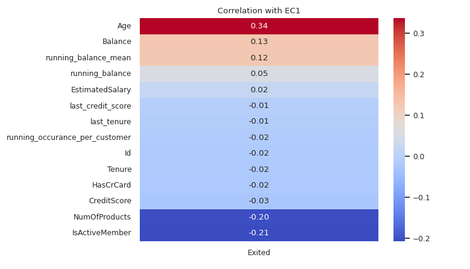

## Correlation to target via scatterplots

For regression tasks we can also use scatterplots to investigate
the relationships of numerical columns to the target variable.

```sh
# show correlation to target
plot_against_target_for_regression(
    train_data,
    feat_type_detector.num_columns,
    "target"
)
```

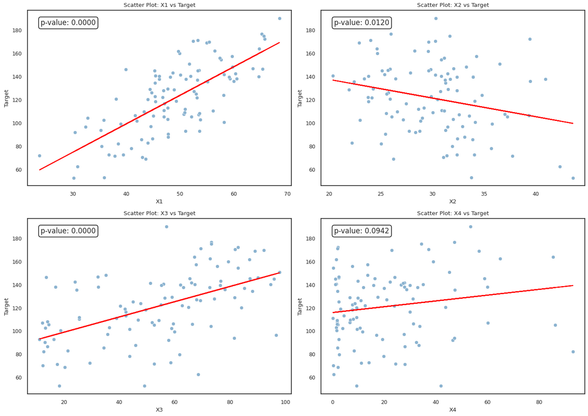

## Correlation heatmap

The correlation heatmap however shows the linear relationships
between features and reveals multicollinearity if present.

```sh
# show correlation heatmap
correlation_heatmap(train_data.loc[:, feat_type_detector.num_columns])
```

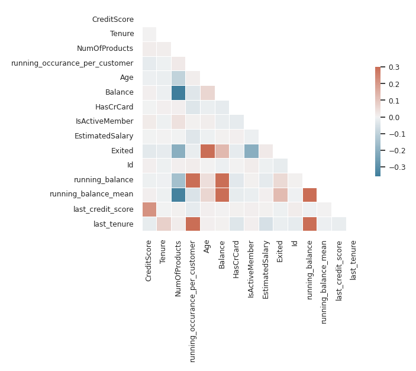

## Andrew Curve

Andrews curve brings the data into a lower space by retaining
the relative distance between other samples and keeping the
variance similar. We can show how similar samples are with
regards to the same output.

```python
from bluecast.eda.analyse import plot_andrews_curve

plot_andrews_curve(
  train_data.loc[:, feat_type_detector.num_columns],
  "target",
  n_samples=20,
  random_state=20
)
```

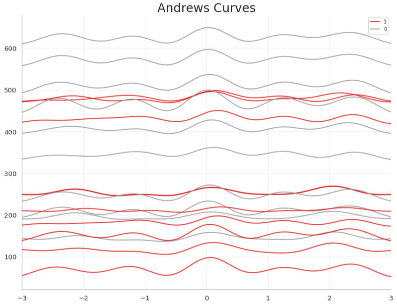

## Association of categorical features

The correlation heatmap requires numerical features. For categories
we make use of Theil's U to build an association heatmap.

```sh
# show a heatmap of assocations between categorical variables
theil_matrix = plot_theil_u_heatmap(train_data, feat_type_detector.cat_columns)
```

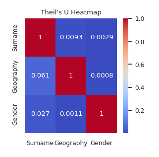

## Mutual information

To capture nonlinear information we can use the mutual information
score. This function has a parameter `class_problem`, that indicates if
it shall be calculated for classification (`binary` or `multiclass`) or
`regression`.

```sh
# show mutual information of categorical features to target
# features are expected to be numerical format
# class problem can be any of "binary", "multiclass" or "regression"
extra_params = {"random_state": 30}
mutual_info_to_target(train_data.loc[:, feat_type_detector.num_columns], "EC1", class_problem="binary", **extra_params)
```

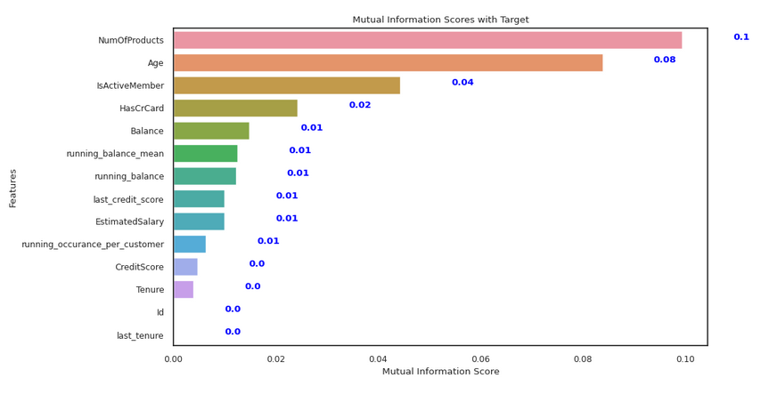

## Principal components analysis (PCA)

How does our feature space look like if we condense the data into
a two-dimensional linear space? Can classes be easily separated?
The `plot_pca` function shows exactly that.

```sh
## show feature space after principal component analysis
plot_pca(
    train_data.loc[:, feat_type_detector.num_columns],
    "target"
    )
```

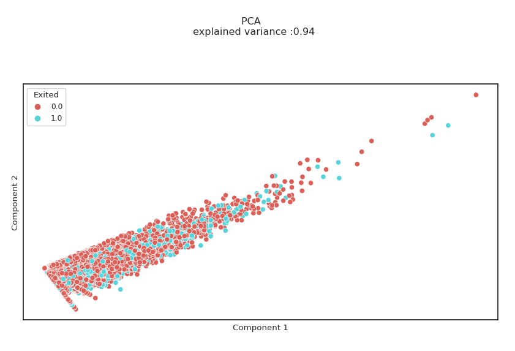

## PCA Biplot

We might be interested to see which feature contributes to which
principal component and by how much. For this purpose the
`plot_pca_biplot` function can be used:

```python
from bluecast.eda.analyse import plot_pca_biplot

plot_pca_biplot(
  train_data.loc[:, feat_type_detector.num_columns],
  "target"
)
```

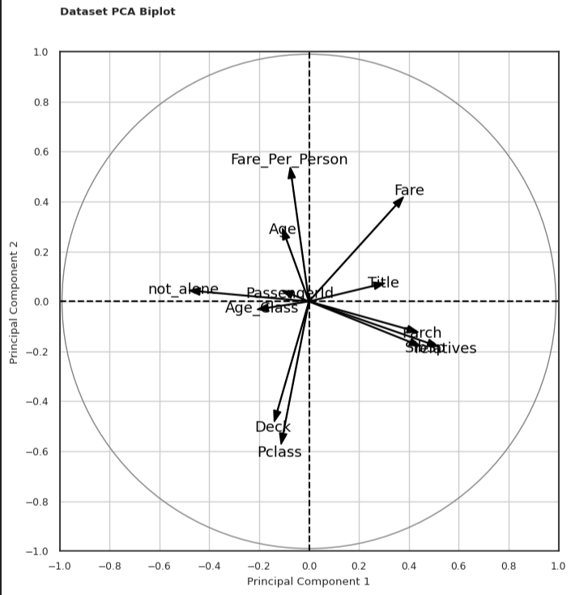

## PCA cumulative variance

Sometimes we want to know how many principal componts we would
need to capture a certain percentage of the dataset's variance.
This can be plotted via:

```sh
## show how many components are needed to explain certain variance
plot_pca_cumulative_variance(
    train_data.loc[:, feat_type_detector.num_columns],
    "target"
    )
```

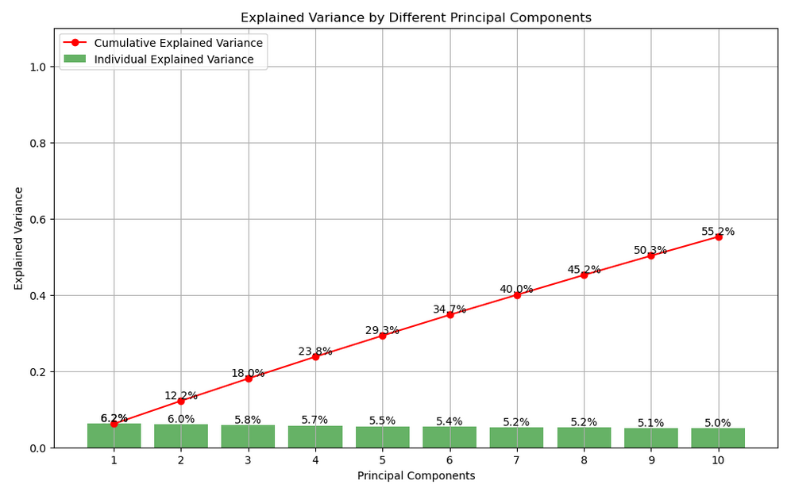

## t-SNE

While PCA captures linear signals, t-SNE also captures the non-linear
information. The `perplexity` parameter needs to be tuned though. Be
aware, that this plot can be very slow to compute depending on data
and `perplexity`.

```sh
# show feature space after t-SNE
plot_tsne(
    train_data.loc[:, feat_type_detector.num_columns],
    "target",
    perplexity=30,
    random_state=0
    )
```

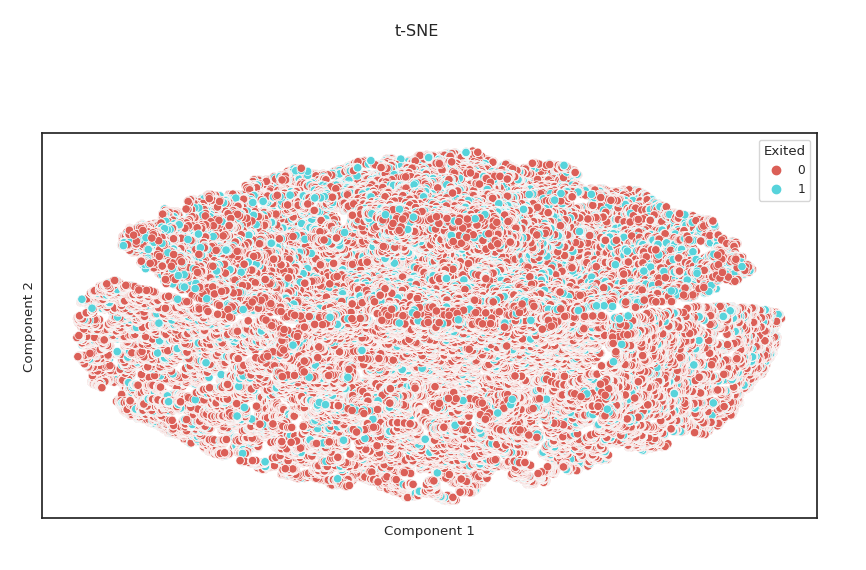

## Target leakage

With big data and complex pipelines target leakage can easily sneak in.
To detect leakage BlueCast offers two functions:

```sh
from bluecast.eda.data_leakage_checks import (
    detect_categorical_leakage,
    detect_leakage_via_correlation,
)


# Detect leakage of numeric columns based on correlation
result = detect_leakage_via_correlation(
        train_data.loc[:, feat_type_detector.num_columns], "target", threshold=0.9
    )

# Detect leakage of categorical columns based on Theil's U
result = detect_categorical_leakage(
        train_data.loc[:, feat_type_detector.cat_columns], "target", threshold=0.9
    )
```

## Feature distribution over time

With the presence of timestamps we often want to understand how the
distribution behaves over time. Does it change? Is there a trend?
For this BlueCast offers the `plot_distribution_by_time` function.

```python
from bluecast.eda.analyse import plot_distribution_by_time

plot_distribution_by_time(train_data, "num_column", "created_at")
```

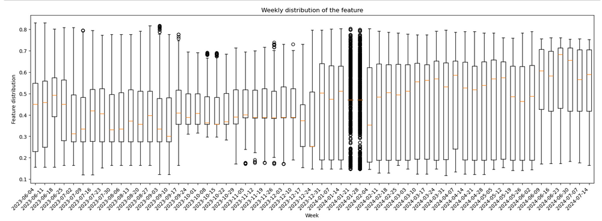
