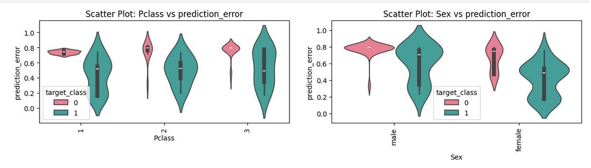
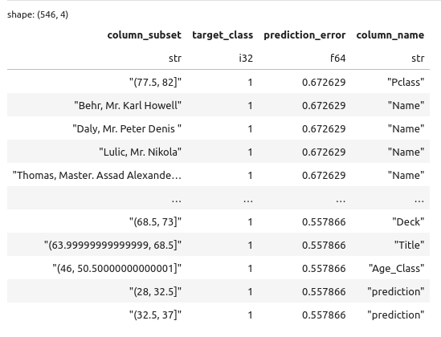

# Error analysis

Error analysis helps understanding in which subsegments of the data
an ml model performs well and in which of them it does not. BlueCast
provides utility for error analysis. The training configuration
has to be prepared for this however.

## What is needed for error analysis

First of all we import the required modules:

```python
from bluecast.blueprints.cast import BlueCast
from bluecast.blueprints.cast_cv import BlueCastCV
from bluecast.config.training_config import TrainingConfig
from bluecast.evaluation.error_analysis import ErrorAnalyserClassification, ErrorAnalyserClassificationCV
```

Next we need to instantiate a BlueCast instance:

```python
automl = BlueCastCV(class_problem="binary") # also multiclass is possible)
```

Next we must set a path to store out of fold datasts during training:

```python
out_of_fold_dataset_store_path = "/your_oof_path/"

# overwrite default settings
automl.conf_training.out_of_fold_dataset_store_path = out_of_fold_dataset_store_path
```

This can also be achieved with:

```python
train_config = TrainingConfig()
train_config.out_of_fold_dataset_store_path = "/your_oof_path/"

automl = BlueCastCV(
    class_problem="binary", # also multiclass is possible
    conf_training=train_config,
)
```

This works with all BlueCast instances.

The last step to enable error analysis is to train the pipeline. Here we need
to use the `fit_eval` method instead of the `fit` method.

```python
automl.fit_eval(train.copy(), target_col=target)
```

## Calling error analysis

After the training pipeline finished we can use the error analysis:

```python
error_analyser = ErrorAnalyserClassification(automl)
analysis_result = error_analyser.analyse_segment_errors()
```

Now we receive two pieces of information:

* a plot for every feature and target class / bin combination
    showing the distribution of mean absolute prediction errors
* a Polars DataFrame showing the mean of mean absolute prediction
errors of all subsegments in the dataset, which can be used for further analysis.





Error analysis is available for all regression models as well.

## Having more fine-grained control

The error analysis can be done in different way:

* fully automated like seen above
* semi-automated by calling the error analysis methods
individually on demand

```python
from bluecast.evaluation.error_analysis import ErrorAnalyserClassification, ErrorAnalyserClassificationCV

analyser = ErrorAnalyserClassification(automl, ignore_columns_during_visualization=["PassengerId"])

# read oof data + predictions (required information is inferred from the automl instance)
oof_data = analyser.read_data_from_bluecast_cv_instance()

# preprocess data: stack predictions by class or target bin
stacked_oof_data = analyser.stack_predictions_by_class(oof_data)

# calculate errors: can also be replaced with custom errors
# the final output needs to have a prediction_error column
errors = analyser.calculate_errors(stacked_oof_data)

# plot error distributions
analyser.plot_error_distributions(errors, "target_class")

# get prediction errors per each actegory or bin of numerical features
errors_analysed = analyser.analyse_errors(errors.drop(analyser.target_column))
```
