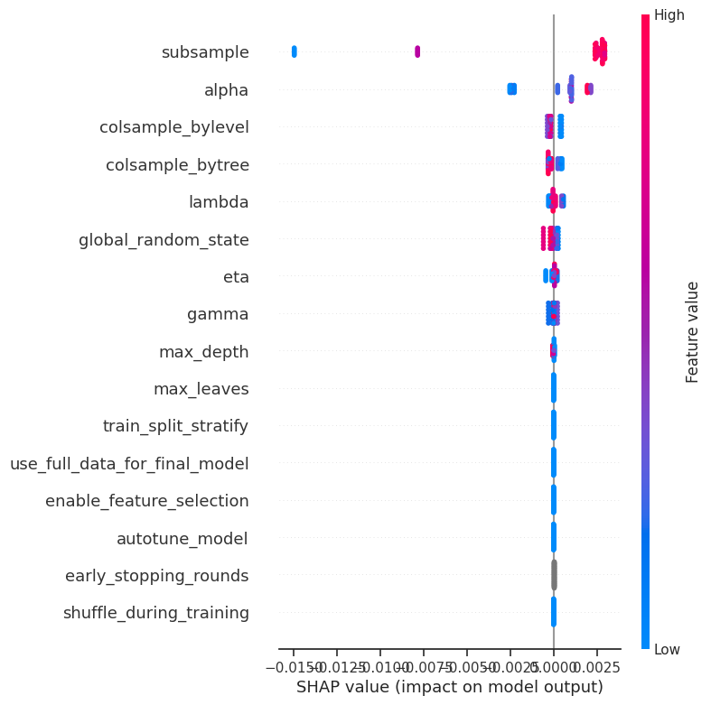

# Experiment tracking

<!-- toc -->

* [Experiment tracking](#experiment-tracking)
  * [Using the inbuilt ExperientTracker](#using-the-inbuilt-experienttracker)
  * [Gain insights across experiments](#gain-insights-across-experiments)

<!-- tocstop -->

## Using the inbuilt ExperientTracker

For experimentation environments it can be useful to store all variables
and results from model runs.
BlueCast has an inbuilt experiment tracker to enhance the provided insights.
No setup is required. BlueCast will automatically store all necessary data
after each hyperparameter tuning trial.

```sh
# instantiate and train BlueCast
from bluecast.blueprints.cast import BlueCast

automl = BlueCast(
        class_problem="binary",
    )

automl.fit_eval(df_train, df_eval, y_eval, target_col="target")

# access the experiment tracker
tracker = automl.experiment_tracker

# see all stored information as a Pandas DataFrame
tracker_df = tracker.retrieve_results_as_df()
```

Now from here you could even feed selected columns back into a BlueCast
instance and try to predict the eval_score to check the get the feature
importance of your experiment data! Maybe you uncover hidden patterns
for your model training.

Please note that the number of stored experiments will probably be lower
than the number of started hyperparameter tuning trials. The experiment tracker
is skipped whenever Optuna prunes a trial.
The experiment triggers whenever the `fit` or `fit_eval` methods of a BlueCast
class instance are called (also within BlueCastCV). This means for custom
models the tracker will not trigger automatically and has to be added manually.

## Gain insights across experiments

The inbuilt experiment tracker can be used to capture information across experiments:

* In non-CV instances it contains information about all hyperparameter tuning runs
* In CV instances it collects the same information across multiple model trainings
* It can be passed from one instance to another to collect information across several
  runs:

```sh
# instantiate and train BlueCast
from bluecast.blueprints.cast import BlueCast

# train model 1
automl = BlueCast(
        class_problem="binary",
    )

automl.fit_eval(df_train, df_eval, y_eval, target_col="target")

# access the experiment tracker
tracker = automl.experiment_tracker

# pass experiment tracker to nd instance or training run
automl = BlueCast(
        class_problem="binary",
        experiment_tracker=tracker
    )
```

We can use the information to derive insights across model trainings:

```sh
from sklearn.ensemble import RandomForestRegressor
import shap

cols = [
    "shuffle_during_training",
    "global_random_state",
    "early_stopping_rounds",
    "autotune_model",
    "enable_feature_selection",
    "train_split_stratify",
    "use_full_data_for_final_model",
    "eta",
    "max_depth",
    "alpha",
    "lambda",
    "gamma",
    "max_leaves",
    "subsample",
    "colsample_bytree",
    "colsample_bylevel"
]

regr = RandomForestRegressor(max_depth=4, random_state=0)

tracker_df = tracker_df.loc[tracker_df["score_category"] == "oof_score"]

experiment_feats_df, experiment_feats_target = tracker_df.loc[:, cols], tracker_df.loc[:, "eval_scores"]

regr.fit(experiment_feats_df.fillna(0), experiment_feats_target.fillna(99))

explainer = shap.TreeExplainer(regr)


shap_values = explainer.shap_values(experiment_feats_df)
shap.summary_plot(shap_values, experiment_feats_df)
```



Here it seems like random seeds had significant impact.

## Use Mlflow via custom ExperientTracker API

The inbuilt experiment tracker is handy to start with, however in production
environments it might be required to send metrics to a Mlflow server or
comparable solutions. BlueCast allows to pass a custom experiment tracker.

```sh
# instantiate and train BlueCast
from bluecast.blueprints.cast import BlueCast
from bluecast.cnfig.base_classes import BaseClassExperimentTracker

class CustomExperimentTracker(BaseClassExperimentTracker):
    """Base class for the experiment tracker.

    Enforces the implementation of the add_results and retrieve_results_as_df methods.
    """

    @abstractmethod
    def add_results(
        self,
        experiment_id: int,
        score_category: Literal["simple_train_test_score", "cv_score", "oof_score"],
        training_config: TrainingConfig,
        model_parameters: Dict[Any, Any],
        eval_scores: Union[float, int, None],
        metric_used: str,
        metric_higher_is_better: bool,
    ) -> None:
        """
        Add results to the ExperimentTracker class.
        """
        pass # add Mlflow tracking i.e.

    @abstractmethod
    def retrieve_results_as_df(self) -> pd.DataFrame:
        """
        Retrieve results from the ExperimentTracker class
        """
        pass


experiment_tracker = CustomExperimentTracker()

automl = BlueCast(
        class_problem="binary",
        experiment_tracker=experiment_tracker,
    )

automl.fit_eval(df_train, df_eval, y_eval, target_col="target")

# access the experiment tracker
tracker = automl.experiment_tracker

# see all stored information as a Pandas DataFrame
tracker_df = tracker.retrieve_results_as_df()
```
