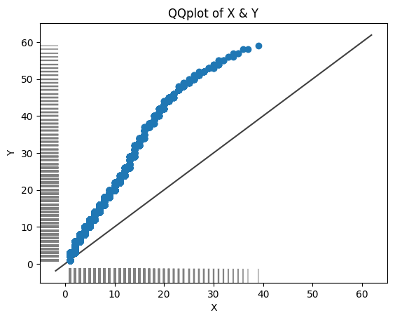

# Monitoring

## Custom data drift checker

Since version 0.90 BlueCast checks for data drift for numerical
and categorical columns. The checks happen on the raw data.
Categories will be stored anonymized by default. Data drift
checks are not part of the model pipeline, but have to be called separately.

### Univariate data drift

Univariate data drift methods check each feature separately. BlueCast
provides the following methods:

#### Kolmogorov-Smirnov test for numerical features

The Kolmogorov-Smirnov test is a non-parametric test of the equality
of continuous, one-dimensional probability distributions that can be
used to compare a sample with a reference probability distribution.

```sh
from bluecast.monitoring.data_monitoring import DataDrift


data_drift_checker = DataDrift()
# statistical data drift checks for numerical features
data_drift_checker.kolmogorov_smirnov_test(data, new_data, threshold=0.05)
# show flags
print(data_drift_checker.kolmogorov_smirnov_flags)
```

#### Population Stability Index for categorical features

The Population Stability Index (PSI) is a measure of the change in the
population distribution of a score. It is commonly used in credit scoring
to monitor the stability of a model.

```sh
data_drift_checker = DataDrift()
# statistical data drift checks for categorical features
data_drift_checker.population_stability_index(data, new_data)
# show flags
print(data_drift_checker.population_stability_index_flags)
# show psi values
print(data_drift_checker.population_stability_index_values)
```

#### QQplot for two numerical columns

The QQplot is a graphical method for comparing two probability distributions
by plotting their quantiles against each other.

```sh
data_drift_checker = DataDrift()

# QQplot for two numerical columns
data_drift_checker.qqplot_two_samples(train["feature1"], test["feature1"], x_label="X", y_label="Y")
```



### Multivariate data drift

Multivariate data drift methods check multiple features at once. It is
recommended to use these methods for a more comprehensive data drift check.
If data drift has been detected, use univariate data drift methods to
identify the features that cause the drift.

#### Adversarial validation

Adversarial validation is a method to check if the distribution of two
datasets is similar. The core question is whether the model can distinguish
between the two and predict the origin of each row. The `adversarial_validation`
return an AUC score. If the AUC score is close to 0.5, the two datasets are
similar. If the AUC score is close to 1, the two datasets are different.

```sh
from bluecast.monitoring.data_monitoring import DataDrift


data_drift_checker = DataDrift()
# statistical data drift checks for numerical features
data_drift_checker.adversarial_validation(data, new_data)
```
